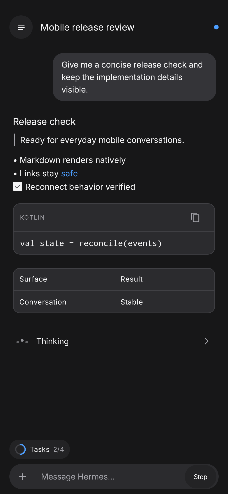
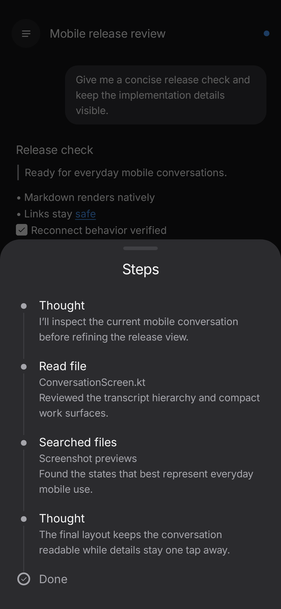
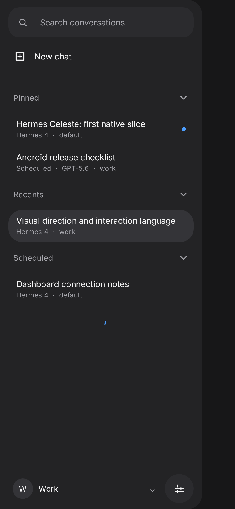

# Celeste

**Your Hermes, carried forward.**

[](https://github.com/hermes-celeste/celeste/releases/download/latest-test/Hermes-Celeste-latest.apk)

Celeste is a native Android client for a self-hosted [Hermes Agent](https://github.com/NousResearch/hermes-agent) dashboard. It connects directly to the same Hermes server as Desktop, so you can continue the same profiles, conversations, and agent work from your phone.

<table>
  <tr>
    <td width="33%"></td>
    <td width="33%"></td>
    <td width="33%"></td>
  </tr>
  <tr>
    <td align="center"><sub>Rich conversation and tasks</sub></td>
    <td align="center"><sub>Thinking steps and tool calls</sub></td>
    <td align="center"><sub>Shared conversation history</sub></td>
  </tr>
</table>

<sub>Screenshots use synthetic test conversations and contain no private data.</sub>

## Use Celeste today

The rolling **[Latest test build](https://github.com/hermes-celeste/celeste/releases/download/latest-test/Hermes-Celeste-latest.apk)** is the current Celeste distribution. It is published after successful checks on `main` and supports Android 9 or newer.

Install the APK, open **Hermes Celeste**, and connect to a Hermes dashboard that your phone can reach over HTTPS, a private network, or Tailscale.

## How to connect

1. [Set up Hermes Agent](https://hermes-agent.nousresearch.com/docs/getting-started/quickstart) and verify that a normal chat works on the Hermes machine.
2. For the easiest private connection, [install Tailscale](https://tailscale.com/kb/1017/install) on the phone and the Hermes machine, then note the machine’s `100.x` address. A same-LAN address also works.
3. On the Hermes machine, configure dashboard username/password authentication and start the dashboard on that reachable address. Nous documents the required bind and authentication setup in [Remote dashboard setup](https://hermes-agent.nousresearch.com/docs/user-guide/features/web-dashboard#remote-dashboard-setup). SSH may be how you administer a remote Hermes machine; Celeste itself connects to the dashboard, not through SSH.
4. In Celeste, enter the dashboard URL, such as `http://100.x.y.z:9119` for a Tailscale address, then sign in with the dashboard username and password.

## What works

- Connect directly to your Hermes dashboard using its existing authentication and profiles
- Create, browse, search, pin, rename, and resume shared conversations
- Send prompts and stream assistant responses, reasoning, and tool activity live
- Inspect Thinking steps, background processes, task progress, and changed files through compact mobile work surfaces
- Read rich Markdown, code, links, checklists, quotes, and tables in the transcript
- Answer agent clarification questions inline
- Send selected images and files through Android’s system pickers
- Redirect text follow-ups into active turns and queue payloads that need the next turn
- Stop active work and recover the current conversation after connection changes

## One Hermes, another surface

Hermes remains the source of truth for profiles, sessions, messages, and agent work. Celeste adds a mobile-native interface without a separate account, relay, or copied conversation store.

Android is the current application target. Protocol behavior, application state, and custom Compose UI are being kept portable so a future iOS target can share the same Kotlin Multiplatform foundation.

## Status

Celeste is usable today as a mobile conversation client and is under active development. Current work expands Hermes capability coverage, customization, and the shared Android/iOS architecture while the rolling test build stays available for everyday use.

## Development

Use the repository environment wrapper with the checked-in Gradle wrapper:

```bash
scripts/celeste-env ./gradlew --no-daemon testDebugUnitTest
scripts/celeste-env ./gradlew --no-daemon lintDebug
scripts/celeste-env ./gradlew --no-daemon validateDebugScreenshotTest
```

GitHub Actions owns APK assembly, signing, and the full regression matrix. See [`AGENTS.md`](AGENTS.md) and [`docs/development.md`](docs/development.md) for the project workflow.
