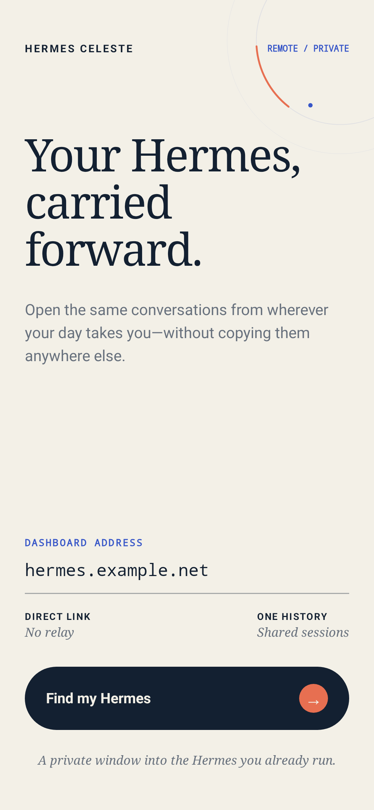

# Design

## Direction

Celeste uses a luminous, minimal heavenly visual language: near-white ivory, ink, warm gold, hairline controls, restrained halo geometry, and a subtle top-down warmth. The interface should feel calm, spacious, and native to Android rather than like a miniature Desktop window.

Apple software is a quality calibration, not a visual identity to copy: prefer quiet hierarchy, clean sans-serif typography, minimal explanatory copy, precise spacing, and controls that feel inevitable. Serif type is a rare atmospheric accent, not the default interface voice. A subtle top-down warmth can unify every surface; halo details belong at edges, transitions, and connection states so conversation-heavy surfaces stay clear.

The current implementation establishes the light surface first. Dark mode remains an intended product surface; do not claim dark-mode support until it is implemented and screenshot-tested.

Do not introduce visual-system codenames or revive rejected branding in source, tests, documentation, or assets.

## Principles

- **Content first.** Transcript, connection state, and the next available action outrank decoration.
- **Effects earn their cost.** Glow, blur, pulse, and motion must communicate hierarchy, connection state, or active work.
- **Nearby controls.** Place actions beside the state or content they affect.
- **Stable geometry.** Loading, streaming, reconnecting, and error states should not cause avoidable layout jumps.
- **State is semantic.** Derive visuals from authoritative gateway/session state, not from animation-local state.
- **More than color.** Pair color with copy, shape, motion, or iconography for state distinctions.
- **Android-native behavior.** Respect system back, IME, navigation insets, lifecycle, accessibility, and reduced motion.
- **One visual system from launch onward.** The native launch window, adaptive icon, system bars, popups, and dialogs must use the same ivory, ink, and warm-gold palette as Compose.
- **Polish the common path.** Connection, session selection, composing, streaming, stopping, and recovery deserve complete states before decorative breadth.

## Current tokens

`app/src/main/java/dev/hazydreams/hermesceleste/ui/CelesteTheme.kt` owns executable color values. This document owns their intended roles:

- ivory / white — page background and raised controls;
- ink — text, primary outlines, and strongest contrast;
- panel / raised panel — quiet grouping and transcript differentiation;
- gold — luminous decoration and halo atmosphere; use the deeper accessible gold token for text, controls, connection state, and active Hermes work;
- muted text / hairline — secondary hierarchy and boundaries;
- error — actionable failure state.

Do not duplicate hexadecimal values here. Change tokens in code and validate affected screenshot states.

## Editorial concept anchor

This recovered connection screen is the selected early direction that established Celeste's editorial warmth, serif-led hierarchy, cobalt and coral accents, generous negative space, and restrained halo geometry. It is an iteration anchor, not a claim that the current production UI implements this composition.

The executable source is `app/src/screenshotTest/kotlin/dev/hazydreams/hermesceleste/CelesteEditorialConceptScreenshotTest.kt`. Its accepted screenshot reference is the reproducibility check; `references/celeste-editorial-concept.png` is the stable human-review artifact. Keep the original concept intact. Create additional named concept previews and reference images when exploring revisions, then deliberately promote accepted choices into production components and tokens.

## Interaction states

Every interactive surface must account for:

- default, pressed, disabled, loading, and error;
- keyboard and IME behavior;
- TalkBack name, role, and state;
- font scaling and narrow-width layout;
- offline/reconnecting behavior when relevant;
- reduced-motion behavior for animation.

Connection state and active agent work are different signals. A connected idle conversation must not look like a running turn.

## Conversation presence and activity

**Status:** accepted backlog direction, not implemented.

Desktop reference: [`references/hermes-desktop-conversation-activity.png`](references/hermes-desktop-conversation-activity.png). Use it as interaction evidence, not a layout to copy.

When conversation presence is designed:

- use a small leading indicator for availability or connection state;
- use static neutral treatment for unavailable, disabled, or disconnected;
- use static semantic emphasis for connected and idle;
- pulse only during active work;
- give the selected row a restrained tinted surface;
- if active work uses traveling illumination, move it through the row or chat bar rather than scaling or flashing the whole surface;
- stop animations when the app or item is not visible;
- provide a reduced-motion treatment that preserves the distinction;
- verify several simultaneous sessions, dark and light themes, contrast, TalkBack, and battery impact.

Do not implement backlog items unchanged merely because they are documented. They still require a concrete design pass and project-owner review.

## Visual acceptance

Host-rendered Compose screenshots are the routine review surface. A changed reference means a design decision, not a test repair. Obtain project-owner review before updating accepted references. The command sequence and evidence bar live in [`testing.md`](testing.md).
